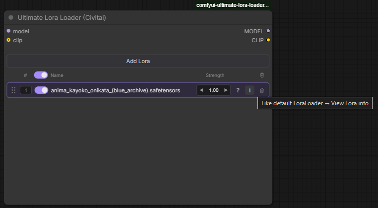
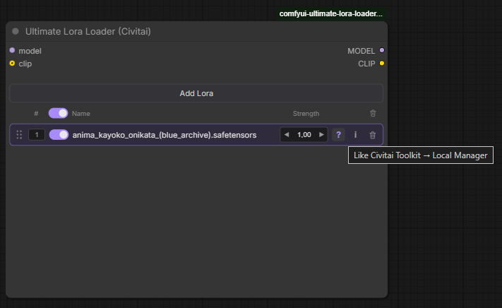

# Ultimate Lora Loader (Civitai)

[](LICENSE)
[](https://github.com/StoneZol/comfyui-ultimate-lora-loader-civitai-toolkit-supported/issues)

Specialized ComfyUI LoRA stack loader based on [Ultimate Lora Loader](https://github.com/WaitWut/comfyui-ultimate-lora-loader).

This is **not** an upstream contribution / PR track — it’s a separate, narrowly focused product: the original folder-browser LoRA stack, plus dual info buttons and a quick folder filter. Bug reports and feature requests go **here**, not to the original repo.

**Bug reports:** [github.com/StoneZol/…/issues](https://github.com/StoneZol/comfyui-ultimate-lora-loader-civitai-toolkit-supported/issues)

Everything from the base node still works (folder browser, optional CLIP, drag-to-reorder, split strengths, missing-file detection, …). This build adds extras on top:

1. **Two per-row info buttons**
    - **`?`** — [Civitai Toolkit](https://github.com/BAIKEMARK/ComfyUI-Civitai-Toolkit) **local DB** popup (gallery-style: name, tags, triggers from indexed scan)
    - **`i`** — [ComfyUI-Custom-Scripts](https://github.com/pythongosssss/ComfyUI-Custom-Scripts) **View Lora info** dialog (the same one as RMB on a default LoraLoader: preview images, Civitai link, trained words, …)
2. **Filter in the Add Lora popup** — searches folders/files in the **currently open** folder (200ms debounce)

Tested with **Civitai Toolkit 4.1.3** and **ComfyUI-Custom-Scripts 1.2.5**.






## What this build adds

| Feature                | Behavior                                                                                                                               |
| ---------------------- | -------------------------------------------------------------------------------------------------------------------------------------- |
| `?` on each row        | Soft dependency on **Civitai Toolkit**. Opens Toolkit’s local-index info popup.                                                        |
| `i` on each row        | Soft dependency on **ComfyUI-Custom-Scripts (pysssss)**. Opens the full **View Lora info** dialog (preview / Civitai link / keywords). |
| Filter in **Add Lora** | Filters the list for the folder you’re currently browsing. Cleared when you drill into a subfolder or click a breadcrumb.              |

For base-node behavior (install notes, CLIP optional, missing-file UX, etc.) see the [original README](https://github.com/WaitWut/comfyui-ultimate-lora-loader#readme).

## Requirements

The loader node itself runs standalone. For the info buttons you also need:

| Button  | Plugin                               | Tested version | Repo                                                                                            |
| ------- | ------------------------------------ | -------------- | ----------------------------------------------------------------------------------------------- |
| **`?`** | Civitai Toolkit                      | **4.1.3**      | [BAIKEMARK/ComfyUI-Civitai-Toolkit](https://github.com/BAIKEMARK/ComfyUI-Civitai-Toolkit)       |
| **`i`** | **ComfyUI-Custom-Scripts** (pysssss) | **1.2.5**      | [pythongosssss/ComfyUI-Custom-Scripts](https://github.com/pythongosssss/ComfyUI-Custom-Scripts) |

Install both into `ComfyUI/custom_nodes` if you want the full experience. Without Custom Scripts, **`i`** will fail with an alert; without Toolkit, **`?`** will.

## Install

```bash
cd ComfyUI/custom_nodes
git clone https://github.com/StoneZol/comfyui-ultimate-lora-loader-civitai-toolkit-supported.git

# also needed for the info buttons:
git clone https://github.com/BAIKEMARK/ComfyUI-Civitai-Toolkit.git
git clone https://github.com/pythongosssss/ComfyUI-Custom-Scripts.git
```

Or copy this folder into `ComfyUI/custom_nodes/` and **fully restart ComfyUI**.

> Don’t install this package _and_ a second copy of the same package side-by-side — duplicate API routes will crash startup. Keeping the original [Ultimate Lora Loader](https://github.com/WaitWut/comfyui-ultimate-lora-loader) installed next to this one is fine (different node / route names).

Node name in the menu: **Ultimate Lora Loader (Civitai)** (`loaders`).

## Usage

1. Add **Ultimate Lora Loader (Civitai)** to the canvas.
2. Wire `model` (and optionally `clip`).
3. **Add Lora** → browse folders → use the filter box to narrow the current folder → pick a file.
4. Click **`?`** for Toolkit local info, or **`i`** for the full View Lora info dialog.

## Bug reports

Open an issue here:

**https://github.com/StoneZol/comfyui-ultimate-lora-loader-civitai-toolkit-supported/issues**

Please include ComfyUI version, Civitai Toolkit / Custom Scripts versions, and a short repro. Do **not** file these against the upstream Ultimate Lora Loader repo — this project is maintained separately.

## Credits

- Based on: [WaitWut / comfyui-ultimate-lora-loader](https://github.com/WaitWut/comfyui-ultimate-lora-loader)
- Toolkit local info: [BAIKEMARK / ComfyUI-Civitai-Toolkit](https://github.com/BAIKEMARK/ComfyUI-Civitai-Toolkit) (tested with **4.1.3**)
- Full View Lora info dialog: [pythongosssss / ComfyUI-Custom-Scripts](https://github.com/pythongosssss/ComfyUI-Custom-Scripts) (tested with **1.2.5**)

MIT — see [LICENSE](LICENSE). Original copyright [WaitWut](https://github.com/WaitWut/comfyui-ultimate-lora-loader); fork modifications © StoneZol.
