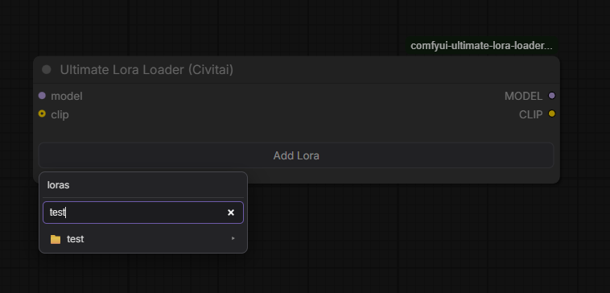
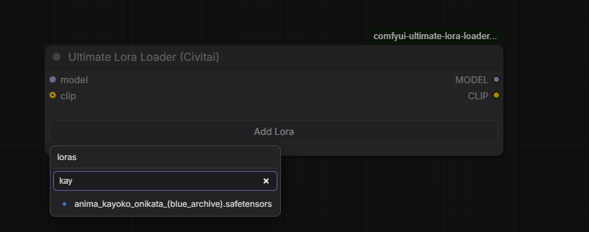

# Ultimate Lora Loader (Civitai)

[](LICENSE)
[](https://github.com/StoneZol/comfyui-ultimate-lora-loader-civitai-toolkit-supported/issues)

Specialized ComfyUI LoRA stack loader based on [Ultimate Lora Loader](https://github.com/WaitWut/comfyui-ultimate-lora-loader).

This is **not** an upstream contribution / PR track — it’s a separate, narrowly focused product: the original folder-browser LoRA stack, plus Civitai Toolkit info and a quick folder filter. Bug reports and feature requests go **here**, not to the original repo.

**Bug reports:** [github.com/StoneZol/…/issues](https://github.com/StoneZol/comfyui-ultimate-lora-loader-civitai-toolkit-supported/issues)

Everything from the base node still works (folder browser, optional CLIP, drag-to-reorder, split strengths, missing-file detection, …). This build adds two extras on top:

1. **Per-row Civitai info (`?`)** — opens the [Civitai Toolkit](https://github.com/BAIKEMARK/ComfyUI-Civitai-Toolkit) model-info modal for that LoRA
2. **Filter in the Add Lora popup** — searches folders/files in the **currently open** folder (200ms debounce)

Compatible with **Civitai Toolkit 4.1.3** (and expected to keep working on nearby 4.x builds that expose `/civitai_utils/get_local_models`).






## What this build adds

| Feature | Behavior |
| --- | --- |
| `?` on each row | Soft dependency on Civitai Toolkit. Fetches Toolkit’s local model index and opens the same style of info popup (name, triggers, description, hash, …). Without Toolkit installed, the button still shows an error alert. |
| Filter field in **Add Lora** | Filters the list for the folder you’re currently browsing. Cleared when you drill into a subfolder or click a breadcrumb. |

For base-node behavior (install notes, CLIP optional, missing-file UX, etc.) see the [original README](https://github.com/WaitWut/comfyui-ultimate-lora-loader#readme).

## Install

**Requires:** [Civitai Toolkit](https://github.com/BAIKEMARK/ComfyUI-Civitai-Toolkit) if you want the `?` info button to do anything useful.

```bash
cd ComfyUI/custom_nodes
git clone https://github.com/StoneZol/comfyui-ultimate-lora-loader-civitai-toolkit-supported.git
```

Or copy this folder into `ComfyUI/custom_nodes/` and **fully restart ComfyUI**.

> Don’t install this package *and* a second copy of the same package side-by-side — duplicate API routes will crash startup. Keeping the original [Ultimate Lora Loader](https://github.com/WaitWut/comfyui-ultimate-lora-loader) installed next to this one is fine (different node / route names).

Node name in the menu: **Ultimate Lora Loader (Civitai)** (`loaders`).

## Usage

1. Add **Ultimate Lora Loader (Civitai)** to the canvas.
2. Wire `model` (and optionally `clip`).
3. **Add Lora** → browse folders → use the filter box to narrow the current folder → pick a file.
4. Click **`?`** on a row to open Civitai Toolkit info for that LoRA.

## Bug reports

Open an issue here:

**https://github.com/StoneZol/comfyui-ultimate-lora-loader-civitai-toolkit-supported/issues**

Please include ComfyUI version, Civitai Toolkit version, and a short repro (what you clicked / what broke). Do **not** file these against the upstream Ultimate Lora Loader repo — this project is maintained separately.

## Credits

- Based on: [WaitWut / comfyui-ultimate-lora-loader](https://github.com/WaitWut/comfyui-ultimate-lora-loader)
- Civitai integration target: [BAIKEMARK / ComfyUI-Civitai-Toolkit](https://github.com/BAIKEMARK/ComfyUI-Civitai-Toolkit) (tested with **4.1.3**)

MIT — same license family as the base project.
